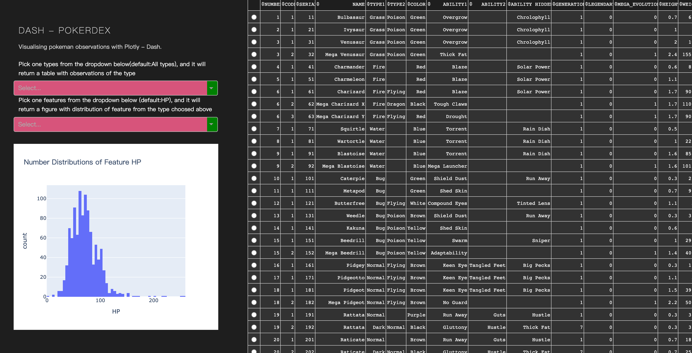

## Environment
pyhon 3.6.12 with Anaconda
## Install
```bash
pip install -r requirements.txt
```
## Run
### Local
run:
```python
python app.py
```
and turn to http://127.0.0.1:8050/ 
### With Heroku

see https://transhi.herokuapp.com/ 


the page can be shown as:



## Refs

https://dash.plotly.com/deployment

https://sourabhbajaj.com/mac-setup/Heroku/